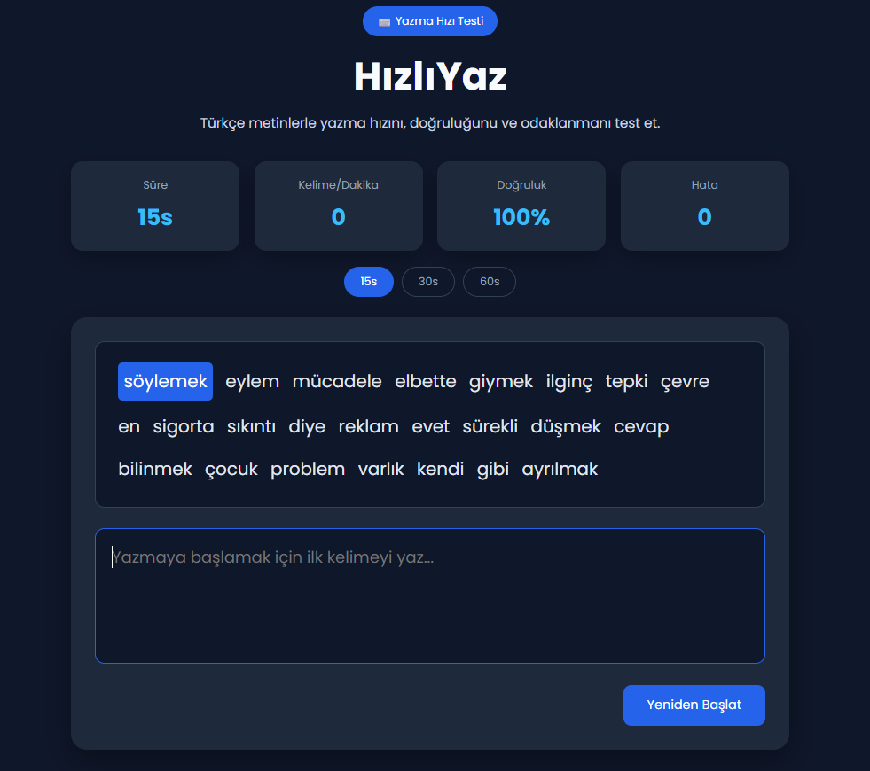

# ⌨️ Hızlı Yazma Testi

A Monkeytype-inspired Turkish typing speed test built with HTML, CSS and JavaScript.

## ✨ Features

- ⌨️ 1000 Turkish words
- ⚡ Real-time WPM (Words Per Minute)
- 🎯 Accuracy calculation
- ❌ Error counter
- 🏆 Best score saved with LocalStorage
- ⏱️ 15 / 30 / 60 second modes
- 🎉 Confetti animation for new high scores
- 📱 Responsive design
- 🌙 Modern dark interface

---

## 🛠️ Technologies

- HTML5
- CSS3
- JavaScript (Vanilla JS)
- LocalStorage

---

## 📷 Screenshot

